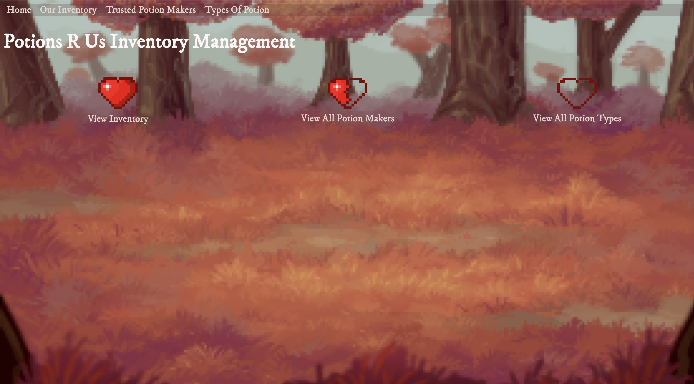
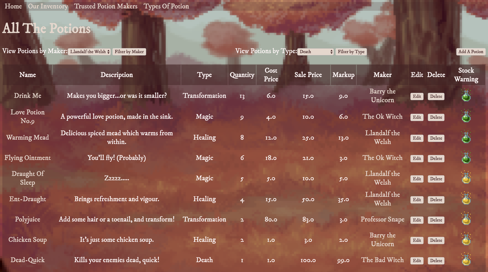
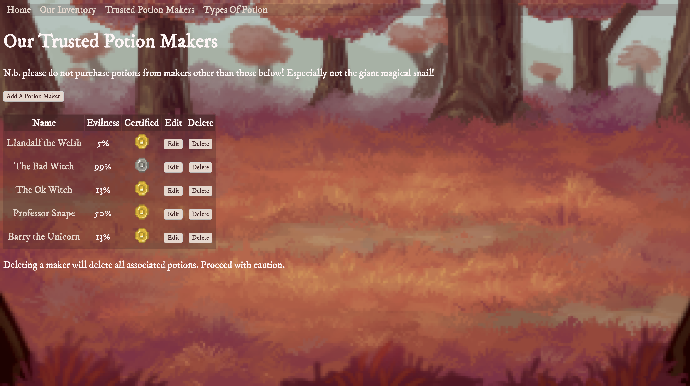
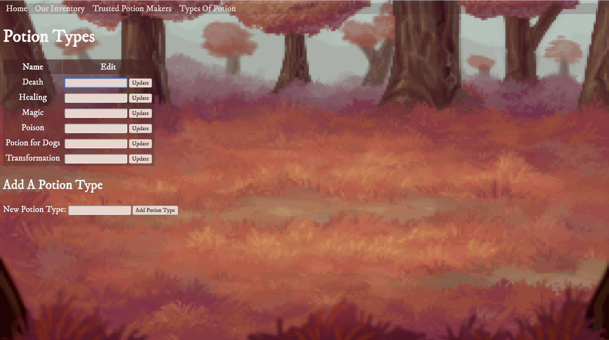

# shop_inventory

This project was completed as my Week 5 - Solo Ruby Project on CodeClan's Software Development Course.

**Brief:** Build an app which allows a shopkeeper to track their shop’s inventory.
1. The app should track individual products and allow these to be added, edited and deleted from the system.
2. The app should track manufacturers.
3. The app should show all inventory in a single view and hilight low stock.
4. The app should calculate markup.
5. Users should be able to filter the products by type and manufacturers.

**Project Notes:**
Having worked in ecommerce I was familiar with some inventory management systems such as Amazon Seller Central, Shopify etc. I wanted to explore the functionality of these systems & model my own inventory view.

This project allowed me to develop my understanding of Ruby, SQL and RESTful routes.
Each class in my project has CRUD functionality which was a focus for this section of the course.

I chose to style my project after low-resolution pixel art games & themed my inventory around fantasy potions.

**Screenshots:**

**Home Page**

**Inventory Index**

**Potion Makers Index**

**Potion Types Index**

**Assets:**
1. Background Image [OpenGameArt](https://opengameart.org/content/backgrounds-3)
2. Pixels [Itch.io](https://tfonez.itch.io/pixel-assets)

**Technologies Used:**
Ruby, Sinatra, HTML, CSS

**Running Instructions:**
1. createdb potion_shop
2. psql -d potion_shop -f db/potion_shop.sql
3. ruby db/seeds.rb
4. ruby app.rb
